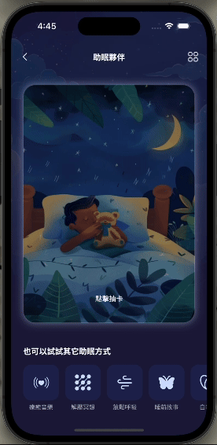
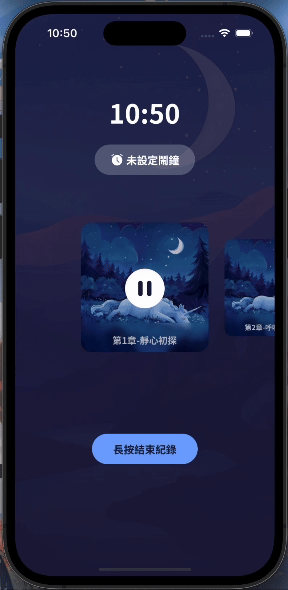
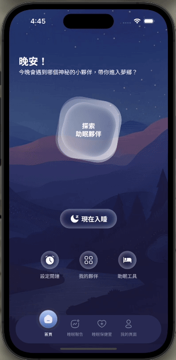
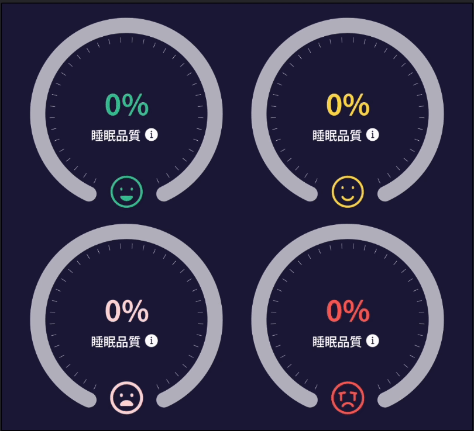

# Goodnight Forest

Compose multiplatform project with sample data

## Screenshot

  
  
  
  
  

## UI/UX Designer

- 貝拉
- 七卡
- Clara
- Alice
- Tingting

## Target

- ✅ Android
- ✅ iOS
- ✅ Desktop

## How To Run

Open project in Android Studio

- Android: Select `composeApp` and run
- iOS: Install plugin "Kotlin Multiplatform", then select `iosApp` and run (open Xcode is required)
- Desktop: Open terminal and run `./gradlew :composeApp:run`

## Special Thanks

* [Compose Multiplatform Wizard](https://github.com/terrakok/Compose-Multiplatform-Wizard)
* [AAPD Team](https://medium.com/as-a-product-designer)
